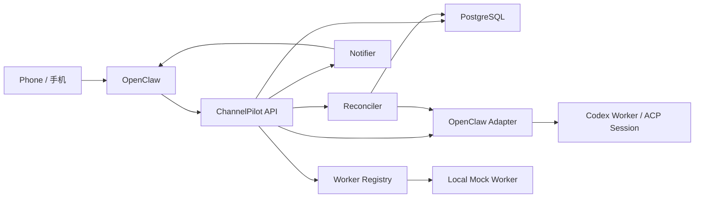

# ChannelPilot

## 中文说明

ChannelPilot 是围绕 OpenClaw 构建的可靠任务控制面。它的系统铁律是：

“部署完成后，我可以直接通过 OpenClaw 的 channels 在手机上命令电脑上的 Codex 干活。”

第一版重点是把架构边界做对，并提供本地可跑通的骨架：

- PostgreSQL 是任务真相源。
- OpenClaw 只通过 adapter 暴露 session / thread binding / steer / cancel / status / reply。
- worker coordination 采用 contract-first。
- `local mock worker` 仅用于开发与测试。
- 真实执行链路当前通过 OpenClaw adapter 对接。

### 当前仓库结构

```text
services/
  channelpilot-api
  channelpilot-reconciler
  channelpilot-notifier
  channelpilot-worker-registry
  channelpilot-mock-worker
packages/
  domain
  db
  openclaw-adapter
  shared-types
docs/
```

### 主要能力

- 任务创建、状态查询、steer、stop、resume、summarize
- append-only `task_events`
- `state_version` 乐观并发控制
- `ingest_idempotency` 与 `inbound_messages` 持久化
- `notification_outbox` 去重、重试、dead-letter
- `worker registry`、heartbeat、assignment metadata、worker lost detection
- 独立 reconciler
- 本地可跑通的 file-backed OpenClaw mock adapter 与 local mock worker

### 职责边界图



### 内部状态到对外状态映射

| 内部状态 | 对外状态 | 对外展示 |
| --- | --- | --- |
| `queued` | `queued` | 已受理 |
| `starting` | `starting` | 准备启动 |
| `binding` | `binding` | 正在绑定 |
| `running` | `running` | 执行中 |
| `waiting_input` | `waiting_input` | 等待输入 |
| `blocked` | `blocked` | 已阻塞 |
| `cancelling` | `running` | 正在取消 |
| `summarizing` | `summarizing` | 整理总结中 |
| `completed` | `completed` | 已完成 |
| `failed` | `failed` | 已失败 |
| `cancelled` | `cancelled` | 已取消 |
| `lost` | `lost` | 状态丢失 |

### 本地开发

1. 复制 `.env.example` 为 `.env` 并按需调整。
2. 安装依赖：`pnpm install`
3. 生成 Prisma client：`pnpm --filter @channelpilot/db exec prisma generate --schema prisma/schema.prisma`
4. 启动数据库 migration：`pnpm db:migrate`
5. 启动服务：
   - `pnpm dev:worker-registry`
   - `pnpm dev:api`
   - `pnpm dev:notifier`
   - `pnpm dev:reconciler`
   - `pnpm dev:mock-worker`
6. 运行测试：`pnpm test`

### 协作对象

- Notion 执行页：<https://www.notion.so/322ffbb2ca1781bcaa9ddd912adea1b3>
- Linear Project：<https://linear.app/haohang-huang/project/channelpilot-delivery-b9886161865d>

## English Summary

ChannelPilot is a reliable task control plane built around OpenClaw. Its system law is:

"Once deployed, I can command desktop Codex from my phone through OpenClaw channels."

The first version focuses on correct boundaries plus a locally runnable scaffold:

- PostgreSQL is the task source of truth.
- OpenClaw is only accessed through the adapter boundary.
- Worker coordination is contract-first.
- The local mock worker is for development and testing only.
- The real execution path is currently integrated through the OpenClaw adapter.

See [architecture.zh-en.md](/E:/workspace/ChannelPilot/docs/architecture.zh-en.md), [assumptions.zh-en.md](/E:/workspace/ChannelPilot/docs/assumptions.zh-en.md), [runbook-reconcile.zh-en.md](/E:/workspace/ChannelPilot/docs/runbook-reconcile.zh-en.md), [smoke-local.zh-en.md](/E:/workspace/ChannelPilot/docs/smoke-local.zh-en.md), and [linear-dependencies-pending.zh-en.md](/E:/workspace/ChannelPilot/docs/linear-dependencies-pending.zh-en.md) for the detailed bilingual documents.
