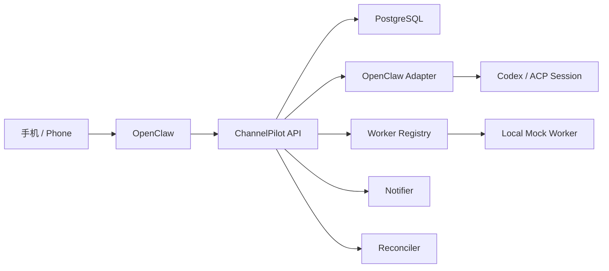

# ChannelPilot 架构说明 / Architecture

## 中文说明

### 目标

ChannelPilot 的目标是把 OpenClaw 线程中的操作意图变成可持久化、可恢复、可审计的 Codex 任务控制流。

### 职责边界图

### 模块边界

- OpenClaw：channels、thread/topic、ACP session、回帖。
- ChannelPilot API：命令归一化、task service、用户接口与 `/internal/*` 接口分离。
- PostgreSQL：任务真相源、事件账本、入站消息、outbox、lease、worker registry。
- Worker Registry：worker metadata、heartbeat、assignment metadata、worker lost detection。
- Notifier：claim/lock 消费 outbox 并通过 adapter 回帖。
- Reconciler：检查 stale task、lease、worker truth 和 session truth。
- Local Mock Worker：开发与测试用的本地模拟实现，不代表生产 worker runtime。

### 内部状态到对外状态映射

| 内部状态 | 对外状态 | 展示文本 |
| --- | --- | --- |
| `queued` | `queued` | 已受理 |
| `starting` | `starting` | 准备启动 |
| `binding` | `binding` | 正在绑定 |
| `running` | `running` | 执行中 |
| `waiting_input` | `waiting_input` | 等待输入 |
| `blocked` | `blocked` | 已阻塞 |
| `cancelling` | `running` | 正在取消 |
| `summarizing` | `summarizing` | 整理总结中 |
| `completed` | `completed` | 已完成 |
| `failed` | `failed` | 已失败 |
| `cancelled` | `cancelled` | 已取消 |
| `lost` | `lost` | 状态丢失 |

### 关键不变量

- 同一 `thread_key` 同一时刻只能有一个非终态 `main` task。
- 只有 task service 和 reconciler 的受控修复可以推进 task 状态。
- `worker lost` 不等于 `task lost`。
- `notification_outbox` 使用数据库唯一去重键和 claim/lock 消费。

## English Summary

### Goal

ChannelPilot turns OpenClaw thread intents into persistent, recoverable, and auditable Codex task control flows.

### Module Boundaries

- OpenClaw: channels, thread/topic handling, ACP sessions, and thread replies.
- ChannelPilot API: command normalization, task service, user routes, and isolated `/internal/*` routes.
- PostgreSQL: source of truth for tasks, events, inbound messages, outbox, leases, and workers.
- Worker Registry: worker metadata, heartbeats, assignment metadata, and worker-loss detection.
- Notifier: claim/lock outbox consumption plus adapter-based replies.
- Reconciler: stale-task, lease, worker-truth, and session-truth checks.
- Local Mock Worker: local development/testing helper only, not the production worker runtime.
